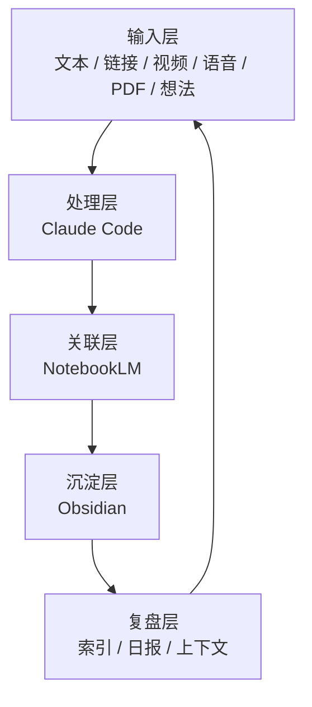
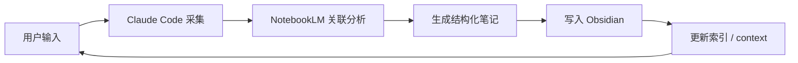

# AI Second Brain Architecture

> 一套 AI 驱动的个人知识管理系统架构，打通 **Claude Code + NotebookLM + Obsidian**，实现从信息输入到结构化知识沉淀的完整闭环。

[](https://opensource.org/licenses/MIT)

---

## 为什么需要这套系统？

信息过载时代，收藏 ≠ 学会，记录 ≠ 掌握。

本架构将个人知识管理（PKM）拆分为清晰的五层：

- **输入层**：统一接收文本、链接、视频、语音、PDF、想法
- **处理层**：用 Claude Code 完成采集、清洗、结构化
- **关联层**：用 NotebookLM 做跨源语义关联
- **沉淀层**：用 Obsidian 做模板化、可检索、可双链的笔记沉淀
- **复盘层**：用自动化脚本维护索引、日报、项目上下文

核心目标：**让信息从“被消费”走向“被关联、被沉淀、被复用”**。

---

## 系统架构



---

## 核心流程



---

## 目录结构

```text
ai-second-brain-architecture/
├── README.md                          # 本文件
├── docs/                              # 完整架构文档
│   ├── 01-system-overview.md
│   ├── 02-input-layer.md
│   ├── 03-processing-layer.md
│   ├── 04-association-layer.md
│   ├── 05-sedimentation-layer.md
│   ├── 06-review-layer.md
│   ├── 07-automation-layer.md
│   ├── 08-directory-structure.md
│   ├── 09-templates.md
│   └── 10-tech-stack.md
├── starter-config/                    # 可直接使用的最小配置
│   ├── obsidian/
│   │   └── community-plugins.json
│   └── templates/
│       ├── research-note.md
│       ├── daily-note.md
│       └── project-note.md
├── examples/                          # 脱敏示例
├── architecture/                      # Mermaid 图源文件
├── scripts/                           # 自动化脚本
└── LICENSE
```

---

## 快速开始

1. **Fork 或 Clone 本仓库**
2. **复制配置到 Obsidian vault**
   - 将 `starter-config/` 下的内容复制到你的 Obsidian vault 根目录
3. **安装推荐插件**
   - Templater：模板自动化
   - Dataview：动态查询笔记
   - Periodic Notes：日报/周报
4. **阅读架构文档**
   - 从 [docs/01-system-overview.md](docs/01-system-overview.md) 开始
5. **接入 Claude Code 与 NotebookLM MCP**
   - 详见 [docs/10-tech-stack.md](docs/10-tech-stack.md)

---

## 技术栈

| 层级 | 工具 | 作用 |
|---|---|---|
| 处理层 | Claude Code / Claude API | 采集、清洗、结构化 |
| 关联层 | NotebookLM (MCP) | 跨源语义检索与关联 |
| 沉淀层 | Obsidian | 笔记存储、双链、图谱 |
| 自动化层 | Python + MCP | 索引更新、日报归档 |
| 格式 | Markdown + YAML frontmatter | 统一笔记格式 |

---

## 设计原则

1. **隐私优先**：本仓库不包含任何私人笔记，只提供架构、模板和脚本
2. **AI 原生**：每个环节都考虑如何与 LLM 协作，而不是让 AI 替代思考
3. **可复制**：任何人都能 fork 后，用自己的内容跑通整个流程
4. **渐进式**：从最小配置开始，按需扩展自动化脚本

---

## 文档导航

- [01 - 系统总览](docs/01-system-overview.md)
- [02 - 输入层](docs/02-input-layer.md)
- [03 - 处理层](docs/03-processing-layer.md)
- [04 - 关联层](docs/04-association-layer.md)
- [05 - 沉淀层](docs/05-sedimentation-layer.md)
- [06 - 复盘层](docs/06-review-layer.md)
- [07 - 自动化层](docs/07-automation-layer.md)
- [08 - 目录结构](docs/08-directory-structure.md)
- [09 - 模板设计](docs/09-templates.md)
- [10 - 技术栈](docs/10-tech-stack.md)

---

## 授权

[MIT](LICENSE)
